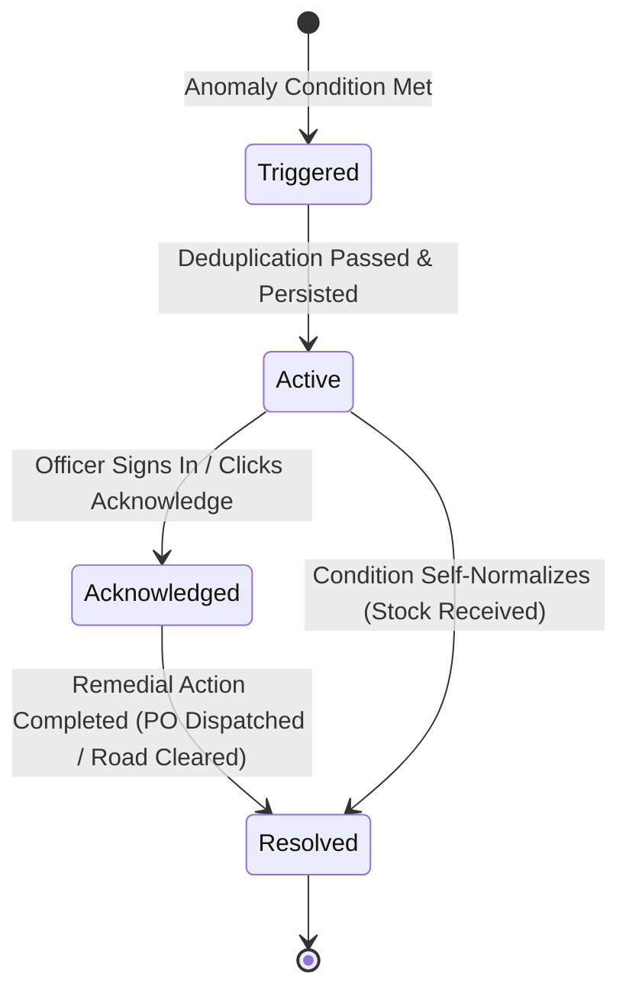

# LogiPredict AI — Anomaly Detection & Alert Generation Logic

## 1. Alert Rule Engine Architecture

The LogiPredict AI alert generation engine operates on a hybrid dual-layer mechanism:
1. **Deterministic Rule-Based Layer**: Real-time evaluation of physical stock thresholds, supply delays, and temperature excursions.
2. **Predictive AI Horizon Layer**: Time-series forecast trajectory evaluation detecting impending stockouts before physical buffers breach.

```mermaid
flowchart TD
    TelemetryIn[Telemetry Inflow\n(Stock Levels, Convoy GPS, Weather)] --> RuleEvaluator{Rule Engine\nEvaluation}
    ForecastIn[14-Day Demand Forecast\n(LSTM + XGBoost)] --> RuleEvaluator

    RuleEvaluator -->|Rule 1: Stock < Min| AlertLowStock[Alert: Low Stock / Critical]
    RuleEvaluator -->|Rule 2: Depletion < LeadTime| AlertStockout[Alert: Predicted Stockout / Critical]
    RuleEvaluator -->|Rule 3: Consumption > 1.5x Mean| AlertSurge[Alert: Demand Surge / Warning]
    RuleEvaluator -->|Rule 4: ETA > Sched + 3h| AlertDelay[Alert: Delayed Supply / Warning]
    RuleEvaluator -->|Rule 5: Risk Score >= 0.70| AlertRoute[Alert: Route Disruption / Critical]
    RuleEvaluator -->|Rule 6: Residual > 3 Sigma| AlertAnomaly[Alert: Forecast Anomaly / Info]

    AlertLowStock & AlertStockout & AlertSurge & AlertDelay & AlertRoute & AlertAnomaly --> DedupHash[Deduplication Filter\nMD5(Type + Entity + Window)]
    DedupHash -->|Hash Already Active| Suppress[Suppress Duplicate Alert]
    DedupHash -->|New Anomaly| Dispatch[Persist Alert & Push to Command Center]
```

---

## 2. Detection Rule Matrix & Threshold Formulas

| Alert Type Slug | Trigger Condition Mathematical Formula | Default Severity | Actionable Operational Recommendation |
|---|---|---|---|
| `low_stock` | $\text{CurrentStock} < \text{MinThreshold}$ | `critical` | Trigger emergency inter-depot stock transfer or express bowser dispatch. |
| `predicted_stockout` | $\text{ProjectedDepletionDays} \le \text{LeadTimeDays} + 2$ | `critical` | Dispatch forward requisition PO to rear base before buffer exhausts. |
| `replenishment_required` | $\text{CurrentStock} \le \text{ReorderLevel} \land \text{ActiveOrders} = 0$ | `warning` | Generate automated draft Purchase Order (PO) for officer sign-off. |
| `demand_surge` | $\text{DailyConsumption}_t \ge 1.5 \times \mu_{\text{historical}}$ | `warning` | Audit unit operational tempo; recalculate 14-day stock replenishment schedule. |
| `delayed_supply` | $\text{CurrentTime} > \text{ScheduledETA} + 3.0\text{ hours}$ | `warning` | Track convoy telematics; alert route commander or dispatch backup vehicle. |
| `route_disruption` | $\text{RouteRiskScore} \ge 0.70 \lor \text{IsBlocked} = \text{True}$ | `critical` | Invoke GIS Dynamic Rerouting heuristic to switch convoy to alternate bypass. |
| `forecast_anomaly` | $|A_t - F_t| > 3 \times \sigma_{\text{residual}}$ | `info` | Flag time-series anomaly to ML pipeline; initiate model recalibration. |
| `cold_chain_excursion` | $T_{\text{telemetry}} < T_{\text{min}} \lor T_{\text{telemetry}} > T_{\text{max}}$ | `critical` | Trigger secondary generator at depot; reroute biologicals to backup chamber. |

---

## 3. Deduplication Strategy & Suppression Window

To prevent alert flooding in operator consoles, every prospective alert computes a deterministic deduplication hash:

$$\text{dedup\_hash} = \text{MD5}\big(\text{alert\_type} \,||\, \text{item\_id/route\_id} \,||\, \text{location\_id} \,||\, \text{date\_window}\big)$$

### Deduplication Rules:
1. If an alert with the same `dedup_hash` exists with `is_resolved = False`, no new alert record is created.
2. If the anomaly severity escalates (e.g. from `warning` to `critical`), the existing alert record is updated in place, updating `updated_at` and notifying the dashboard without creating noise.
3. Once an officer marks an alert `is_resolved = True`, a subsequent breach in a future operational cycle will generate a fresh alert record.

---

## 4. Alert Lifecycle State Machine



### State Definitions:
- **`Active (Unacknowledged)`**: Anomaly is live; highlighted with red pulsing badge on sidebar and overview cards.
- **`Acknowledged`**: Logistics officer has inspected the advisory; logs officer callsign and timestamp.
- **`Resolved`**: Physical replenishment verified or route cleared; stores audit resolution notes.
