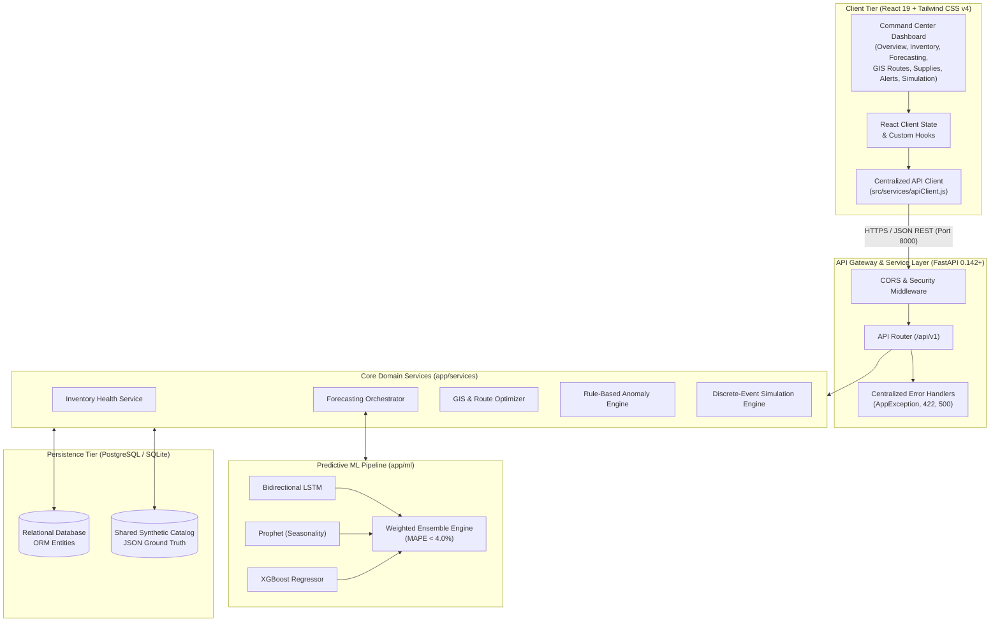
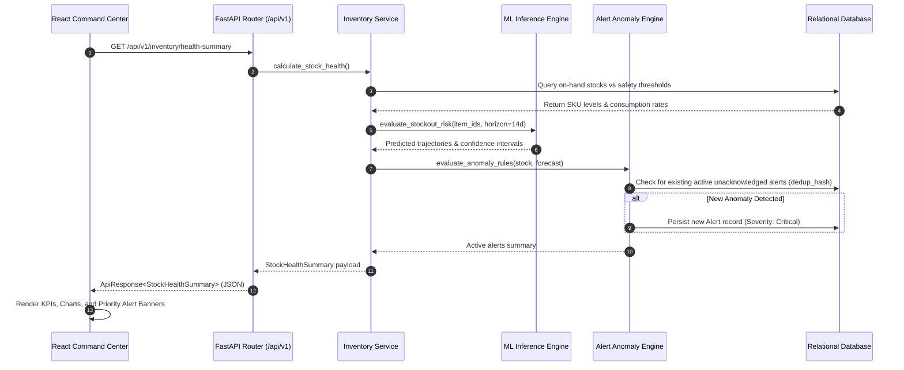

# LogiPredict AI — System Architecture Specification

## 1. Executive Overview

**LogiPredict AI** is an AI-powered predictive logistics, forward supply chain optimization, and multi-echelon inventory management platform developed for the **Indian Army** (Smart India Hackathon 2026).

The platform delivers proactive situational awareness, neural demand forecasting, GIS-driven convoy route risk assessment, automated replenishment requisitioning, and discrete-event stress-test simulations across rugged, high-altitude operational sectors (e.g. Northern Command, Ladakh, Kargil, Siachen).

---

## 2. Architectural Principles & Layer Boundaries

| Layer | Technology | Primary Responsibilities | Boundaries & Isolation |
|---|---|---|---|
| **Presentation Tier** | React 19, Vite, Tailwind CSS v4, Lucide Icons, Recharts, Leaflet | UI rendering, responsive layouts, data visualization, client-side route navigation. | Purely decoupled from backend. Communicates exclusively via `apiClient.js` using JSON envelopes. |
| **API Gateway Tier** | FastAPI, Uvicorn, Pydantic v2 | Routing, schema validation, HTTP status mapping, CORS filtering, standardized error envelopes. | Enforces strict contract validation before passing sanitized payloads to service layer. |
| **Domain Services Tier** | Python 3.11+, Scikit-Learn | Business logic: safety buffer computations, replenishment logic, alert deduplication, convoy payload calculations. | Free from direct HTTP or UI dependencies; reusable by background cron workers and simulation workers. |
| **Predictive ML Tier** | NumPy, Pandas, Scikit-learn, Time-Series Ensembles | Feature transformers, historical demand smoothing, multi-horizon inference, weather/altitude adjustments. | Stateless inference pipelines receiving clean feature matrices and returning confidence intervals. |
| **Persistence Tier** | PostgreSQL (Production) / SQLite (Local Dev) | Relational integrity, foreign key constraints, indexing on location/item/time axes. | Schema designed to support atomic transactions, audit logs, and deterministic simulations. |

---

## 3. Data Flow Architecture

The following sequence outlines how an automated inventory health check, neural forecast generation, and anomaly alert dispatch flow through the system:

---

## 4. Security, Authentication & Deployment Strategy

1. **Environment Configuration**:
   - Frontend reads `VITE_API_BASE_URL` (defaulting to `http://localhost:8000/api/v1`).
   - Backend reads `.env` via `app.config.py` for `DATABASE_URL`, `SECRET_KEY`, and `ALLOWED_ORIGINS`.
2. **Authentication Roadmap**:
   - Bearer JWT token in `Authorization: Bearer <token>` HTTP header.
   - Role-Based Access Control (RBAC):
     - `COMMAND_OFFICER`: Full access to requisitions, forecasts, convoy rerouting, and simulation dispatch.
     - `DEPOT_OPERATOR`: Stock count updates, dispatch vouchers, receipt acknowledgments.
     - `VIEWER_ANALYST`: Read-only telemetry, reports, and analytics.
3. **CORS Security**:
   - Strict origin allowlist configured for trusted dashboard origins (`http://localhost:5173`, `http://127.0.0.1:5173`).
4. **Resilience & Fault Tolerance**:
   - Standard 15-second request timeouts with explicit `AbortController` in frontend.
   - Graceful degradation: offline dashboard fallbacks preserve user workflows if network connection is lost.
