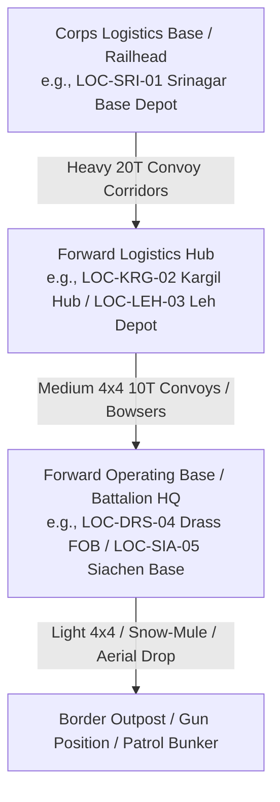

# LogiPredict AI — Domain Data Dictionary

## 1. Supply Classification & Categories (Indian Army Forward Logistics)

| Category Slug | Category Display Name | Description | Example Standard SKUs | Base Unit of Measurement (UoM) |
|---|---|---|---|---|
| `POL` | **Petroleum, Oil, and Lubricants** | Extreme-cold fuels, aviation fuel, specialized anti-freeze lubricants, and kerosene for bunker heaters. | Winter-Grade Diesel ATF-800, Aviation Turbine Fuel, High-Altitude Kerosene (SKO). | Liters (L) / Kiloliters (kL) |
| `Ordnance & Ammunition` | **Ordnance & Munitions** | Small arms ball ammunition, mortar bombs, artillery shells, anti-tank guided munitions, and smoke canisters. | 5.56mm INSAS Ball Tins (1000 rds), 81mm Mortar Shells (Crates), 155mm Bofors Shells. | Rounds / Tins / Crates / Units |
| `Rations & Subsistence` | **Rations & Food Supplies** | Ready-to-Eat (MRE) self-heating meal packs, freeze-dried staples, potable bottled water, high-calorie energy bars. | 24-hr High-Altitude MRE Combat Packs, Potable Water 20L Jerrycans, Fortified Grains. | Packs / Cartons / Jerrycans / MT |
| `Medical & Cold-Chain` | **Medical & Specialized Pharmaceuticals** | Combat trauma bandage kits, freeze-dried plasma, altitude-sickness medications (Diamox), cold-chain serums. | Freeze-Dried Blood Plasma, High-Altitude Tactical Trauma Packs, Lyophilized Vaccines. | Kits / Vials / Doses |
| `Spares & Engineering` | **Spares, Fleet & Defense Works** | Sub-zero vehicle starter batteries, run-flat convoy tyres, snow chain sets, modular bunker insulation panels. | LiFePO4 24V Extreme-Cold Batteries, All-Terrain Run-Flat Tyres, Track Repair Pins. | Units / Sets / Spares |
| `General Stores` | **General & Extreme-Cold Clothing** | Extreme Cold Weather Clothing System (ECWCS), sub-zero sleeping bags, arctic tents, heating stoves. | ECWCS Layer-3 Parkas, Multi-Fuel Bunker Stoves, Thermal Sleeping Bags (-50C). | Sets / Units |

---

## 2. Supply Network Echelons & Node Hierarchy

### 2.1 Node Definitions

1. **`Corps_HQ / Base_Depot`**:
   - Deep rear logistics reservoir connected to national rail/road arterial networks. High capacity (4,000 to 10,000 MT), bulk fuel farms, major repair workshops.
2. **`Forward_Logistics_Hub`**:
   - Regional echelon node storing 15 to 45 days of operational buffer. Equipped with automated loading bays, fuel decanting pumps, and cold-chain refrigerated chambers.
3. **`Forward_Operating_Base (FOB)`**:
   - High-altitude tactical garrison directly feeding frontline combat units. Storage is constrained (500 to 1,500 MT) and vulnerable to seasonal isolation.
4. **`Border_Outpost`**:
   - Tactical bunker outpost relying on just-in-time replenishment from parent FOB.

---

## 3. Mathematical Definitions & Derived Metrics

### 3.1 Days of Supply Remaining ($DOS$)
$$DOS = \frac{\text{Current Stock (Units)}}{\text{Average Daily Consumption Rate (Units/Day)}}$$

### 3.2 Stock Health Ratio ($SHR$)
$$SHR = \left( \frac{\text{Current Stock}}{\text{Max Capacity}} \right) \times 100\%$$

- **Optimal**: $\text{Current Stock} > \text{Reorder Level}$
- **Warning**: $\text{Min Threshold} \le \text{Current Stock} \le \text{Reorder Level}$
- **Critical**: $\text{Current Stock} < \text{Min Threshold}$

### 3.3 Forecast Error Metric (Mean Absolute Percentage Error — $MAPE$)
$$MAPE = \frac{100\%}{n} \sum_{t=1}^{n} \left| \frac{A_t - F_t}{A_t} \right|$$
*Where $A_t$ is actual observed consumption and $F_t$ is neural model forecast.* Target SIH benchmark: $MAPE \le 3.5\%$.

---

## 4. Synthetic Data Disclaimer & Ethical Usage Notice

> **CONFIDENTIALITY & SYNTHETIC DATA NOTICE**:
> All entity identifiers (e.g. `SKU-POL-DSL-01`, `LOC-FOB-LEH-01`), GPS coordinates, baseline consumption values, vehicle capacities, and disruption scenarios in LogiPredict AI are **100% synthetic mathematical abstractions**. They are created solely for algorithmic demonstration, software architecture evaluation, and user experience design in the **Smart India Hackathon 2026**.
>
> They do **not** disclose or represent real-world Indian Armed Forces operational inventories, unit deployments, or classified defense logistics parameters.
