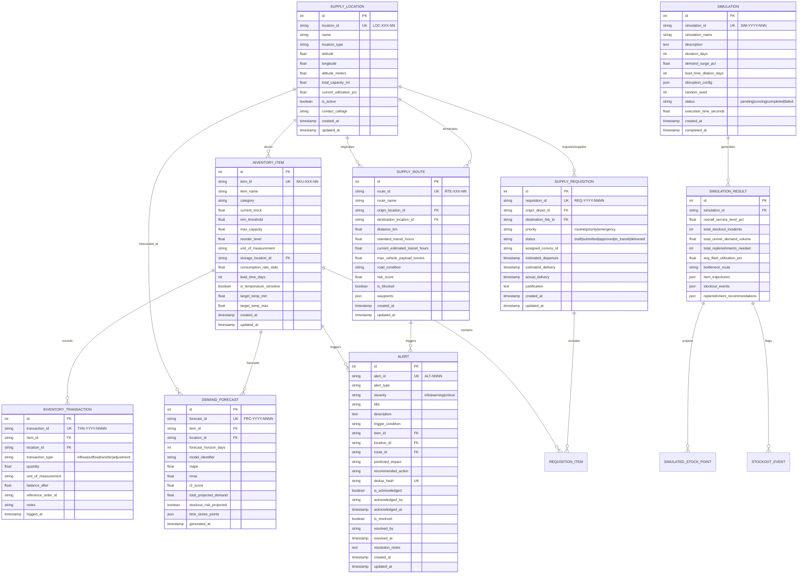

# LogiPredict AI — Relational Database Schema Specification

## 1. Schema Design Philosophy

The LogiPredict AI database schema is designed to model multi-echelon forward supply chains for defense logistics. It balances high relational integrity (ACID compliance, strict foreign key cascading, check constraints) with high-throughput time-series forecasting records and event logs.

- **Primary Target Database**: PostgreSQL 15+
- **Local Development Compatibility**: SQLite 3.35+
- **ORM Compatibility**: SQLAlchemy 2.0+ / Pydantic v2 serialization

---

## 2. Entity-Relationship Diagram (ERD)

---

## 3. Detailed Table Specifications & Constraints

### 3.1 `supply_locations` (Locations Master)
- **Primary Key**: `id` (SERIAL / INTEGER)
- **Unique Key**: `location_id` (`VARCHAR(32)`)
- **Indexes**: `CREATE INDEX idx_location_type ON supply_locations(location_type);`
- **Constraints**:
  - `CHECK (latitude BETWEEN -90.0 AND 90.0)`
  - `CHECK (longitude BETWEEN -180.0 AND 180.0)`
  - `CHECK (total_capacity_metric_tonnes > 0)`

### 3.2 `inventory_items` (SKU Master & Real-Time Stock)
- **Primary Key**: `id` (SERIAL / INTEGER)
- **Unique Key**: `item_id` (`VARCHAR(64)`)
- **Foreign Key**: `storage_location_id` REFERENCES `supply_locations(location_id)` ON DELETE RESTRICT
- **Indexes**:
  - `CREATE INDEX idx_item_location ON inventory_items(storage_location_id);`
  - `CREATE INDEX idx_item_category ON inventory_items(category);`
- **Constraints**:
  - `CHECK (current_stock >= 0)`
  - `CHECK (min_threshold >= 0)`
  - `CHECK (max_capacity > min_threshold)`

### 3.3 `inventory_transactions` (Audit Log & Ledger)
- **Primary Key**: `id` (SERIAL / INTEGER)
- **Unique Key**: `transaction_id` (`VARCHAR(64)`)
- **Foreign Keys**:
  - `item_id` REFERENCES `inventory_items(item_id)` ON DELETE RESTRICT
  - `location_id` REFERENCES `supply_locations(location_id)` ON DELETE RESTRICT
- **Indexes**:
  - `CREATE INDEX idx_txn_item_time ON inventory_transactions(item_id, logged_at DESC);`
  - `CREATE INDEX idx_txn_location ON inventory_transactions(location_id);`

### 3.4 `supply_routes` (Transit Corridors & Road Telematics)
- **Primary Key**: `id` (SERIAL / INTEGER)
- **Unique Key**: `route_id` (`VARCHAR(32)`)
- **Foreign Keys**:
  - `origin_location_id` REFERENCES `supply_locations(location_id)` ON DELETE RESTRICT
  - `destination_location_id` REFERENCES `supply_locations(location_id)` ON DELETE RESTRICT
- **Indexes**:
  - `CREATE INDEX idx_route_endpoints ON supply_routes(origin_location_id, destination_location_id);`
  - `CREATE INDEX idx_route_risk ON supply_routes(risk_score);`

### 3.5 `demand_forecasts` (Time-Series AI Inference Runs)
- **Primary Key**: `id` (SERIAL / INTEGER)
- **Unique Key**: `forecast_id` (`VARCHAR(64)`)
- **Foreign Keys**:
  - `item_id` REFERENCES `inventory_items(item_id)` ON DELETE CASCADE
  - `location_id` REFERENCES `supply_locations(location_id)` ON DELETE CASCADE
- **Indexes**:
  - `CREATE INDEX idx_forecast_item_gen ON demand_forecasts(item_id, generated_at DESC);`

### 3.6 `alerts` (Rule-Based & Predictive Anomaly Table)
- **Primary Key**: `id` (SERIAL / INTEGER)
- **Unique Key**: `alert_id` (`VARCHAR(32)`)
- **Unique Constraint**: `dedup_hash` (`VARCHAR(64)`) UNIQUE (Active alert deduplication)
- **Foreign Keys**:
  - `item_id` REFERENCES `inventory_items(item_id)` ON DELETE SET NULL
  - `location_id` REFERENCES `supply_locations(location_id)` ON DELETE SET NULL
  - `route_id` REFERENCES `supply_routes(route_id)` ON DELETE SET NULL
- **Indexes**:
  - `CREATE INDEX idx_alert_severity_status ON alerts(severity, is_resolved, is_acknowledged);`
  - `CREATE INDEX idx_alert_created ON alerts(created_at DESC);`
