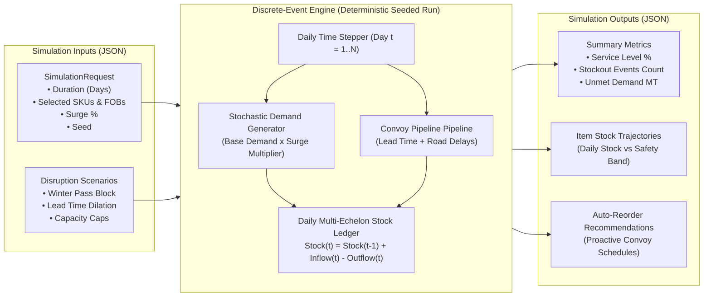

# LogiPredict AI — Simulation Engine Contracts & Scenarios

## 1. Simulation Engine Architecture

The LogiPredict AI simulation engine is a **discrete-event / Monte Carlo multi-echelon forward supply chain stress-tester**. It allows logistics commanders to inject disruption events (such as winter highway closures, high-intensity ammunition surges, or convoy route landslides) and observe 30-to-180-day simulated supply autonomy and stockout risks.



---

## 2. Standard Disruption Scenarios

| Scenario Slug | Operational Scenario Description | Injected System Stresses |
|---|---|---|
| `baseline_peacetime` | Standard peacetime stocking and routine troop consumption. | Variance: $\pm 5\%$, Standard lead times (2-5 days). |
| `winter_pass_closure` | Zoji La / Khardung La passes cut off by heavy blizzards for 21 days. | Route blocked: `RTE-SRI-KRG-01`; Inflows to Kargil/Leh zeroed out unless aerial drop simulated. |
| `high_intensity_surge` | Elevated operational tempo across forward border posts. | POL consumption $\times 3.0$; Ammunition burn $\times 4.5$; Rations $\times 1.2$. |
| `avalanche_landslide` | Major debris slide blocks transit corridor for 6 days. | Lead times dilated $+100\%$; Convoy risk score spiked to $0.88$. |
| `cold_chain_power_failure` | Forward depot generator breakdown in extreme cold. | Medical cold-chain shelf-life decays $\times 5$; 20% spoilage loss. |

---

## 3. Simulation JSON Contracts

### 3.1 Input Payload Example (`POST /api/v1/simulation/run`)

```json
{
  "simulation_name": "Op Winter Shield — 45-Day Kargil Pass Cutoff Test",
  "description": "Stress-testing Drass & Kargil fuel and ammunition autonomy during heavy Zoji La snow blockage.",
  "duration_days": 45,
  "selected_item_ids": ["SKU-POL-KRS-02", "SKU-ORD-81M-04", "SKU-RAT-MRE-05"],
  "selected_location_ids": ["LOC-KRG-02", "LOC-DRS-04"],
  "demand_surge_percentage": 25.0,
  "lead_time_dilation_days": 4,
  "transport_capacity_limit_tonnes": 40.0,
  "disruptions": [
    {
      "scenario_type": "winter_pass_closure",
      "start_day": 8,
      "duration_days": 21,
      "severity_multiplier": 2.0,
      "affected_routes": ["RTE-SRI-KRG-01"],
      "affected_locations": ["LOC-DRS-04"]
    }
  ],
  "random_seed": 42
}
```

### 3.2 Output Response Example (`ApiResponse[SimulationResultResponse]`)

```json
{
  "success": true,
  "data": {
    "simulation_id": "SIM-2026-0881",
    "simulation_name": "Op Winter Shield — 45-Day Kargil Pass Cutoff Test",
    "status": "completed",
    "created_at": "2026-10-02T10:00:00Z",
    "completed_at": "2026-10-02T10:00:03Z",
    "execution_time_seconds": 2.84,
    "summary_metrics": {
      "total_simulated_days": 45,
      "overall_service_level_percentage": 91.4,
      "total_stockout_incidents": 1,
      "total_unmet_demand_volume": 4200.0,
      "total_replenishment_orders_needed": 3,
      "average_fleet_capacity_utilization_percentage": 86.5,
      "critical_bottleneck_route": "RTE-SRI-KRG-01"
    },
    "stockout_events": [
      {
        "event_id": "SO-01",
        "item_id": "SKU-POL-KRS-02",
        "item_name": "High-Altitude Kerosene SKO (Bunker Heating)",
        "location_id": "LOC-DRS-04",
        "location_name": "Drass Forward Operating Base",
        "start_day": 24,
        "duration_days": 5,
        "total_unmet_units": 4200.0,
        "severity": "Critical"
      }
    ],
    "replenishment_recommendations": [
      {
        "recommendation_id": "REC-01",
        "item_id": "SKU-POL-KRS-02",
        "item_name": "High-Altitude Kerosene SKO (Bunker Heating)",
        "source_location_id": "LOC-SRI-01",
        "target_location_id": "LOC-DRS-04",
        "recommended_order_day": 4,
        "recommended_quantity": 25000.0,
        "unit_of_measurement": "Liters",
        "estimated_arrival_day": 7,
        "rationale": "Pre-position fuel at Drass prior to Day 8 Zoji La pass closure to avoid Day 24 depletion."
      }
    ],
    "item_trajectories": {
      "SKU-POL-KRS-02": [
        {
          "day": 1,
          "date_offset": "Day 1 (2026-10-02)",
          "projected_stock": 24000.0,
          "inflow_received": 0.0,
          "demand_consumed": 1800.0,
          "unmet_demand": 0.0,
          "safety_stock_threshold": 25000.0,
          "is_stockout": false
        }
      ]
    }
  }
}
```
